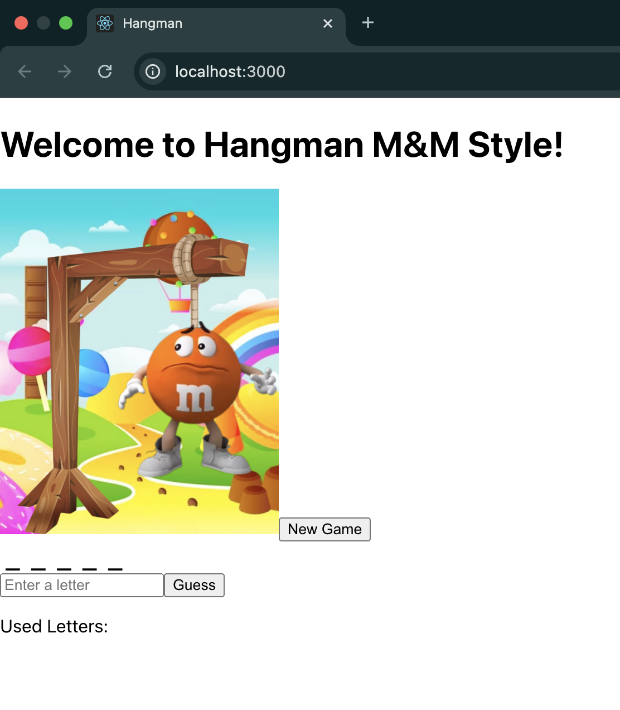

# 🎮 Hangman Game (M&M Edition) 🍫

Welcome to the **Hangman Game**, where instead of a traditional hangman, an **M&M character loses limbs** as you guess incorrectly! 🚀🔥  

## 📌 Features
✅ Custom **M&M-themed images**  
✅ **Tracks used letters** so you don’t repeat guesses  
✅ **State managed properly with React class components**  
✅ **Fun words that aren’t too easy or too hard!**  

## 🖼️ Screenshot  
Here’s what the game looks like:  



---

## **🚀 How to Install & Run**
Follow these steps to **download and play the game** on your computer:

### **1️⃣ Clone the Repository**
Open your terminal and run:
```bash
git clone https://github.com/YOUR_GITHUB_USERNAME/Hangman-Game.git
cd Hangman-Game
```

### **2️⃣ Install Dependencies**
Run this command inside the project folder:
```bash
npm install
```

### **3️⃣ Start the Game**
To start the game, run:
```bash
npm start
```
Then open **http://localhost:3000** in your browser.

---

## **🛠️ Technologies Used**
- React.js ⚛️
- JavaScript  
- HTML & CSS  

---

## **👤 Author**
**Aunaje' Caldwell**  
📧 Email: caldwellaunaje@gmail.com  

